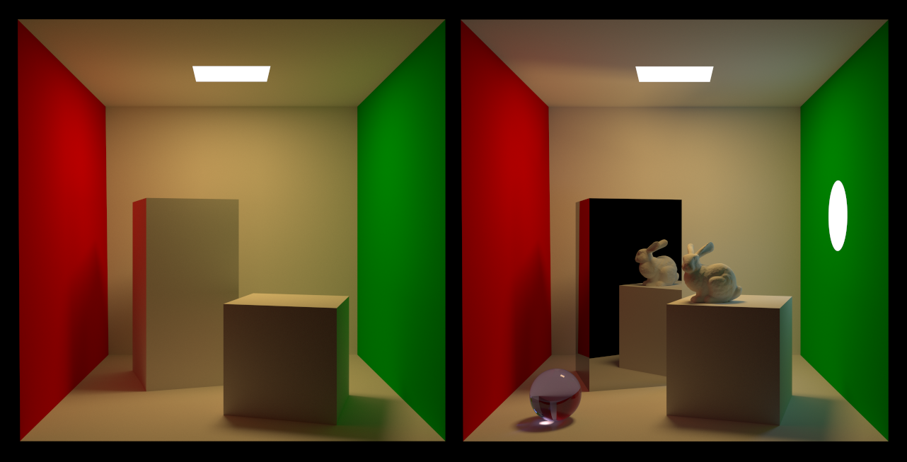

# Ray-Tracing on Graphcore IPUs

This project is a redesign of an experimental ray/path-tracer for IPU (old version is [here](https://github.com/markp-gc/ipu_path_trace)). This new version is completely re-architected with the aim of making it more flexible and easier to extend. There has also been some attempt at making it interoperable with Embree (which is used to build an initial bounding volume hierachy).



## Try it immediately in a free notebook

The simplest way to experiment with the renderer is by launching a pre-built docker container on a cloud service.
Paperspace, for example, provides free IPU-POD4 machines. Click this link and follow the instructions in the README.ipynb notebook:

[](https://console.paperspace.com/github/markp-gc/gradient_poplar_raytracer?container=mpupilli/poplar_paperspace&machine=Free-IPU-POD4&file=README.ipynb)

(Using this method you do not have to worry about installing the right apt packages or configuring the IPU-POD.)

## New Software Architecture

Key improvements of this implementation over the original are:

- Triangle meshes are now supported.
- An in SRAM acceleration structure is now supported:
  - A BVH built by Embree is compacted to fit in IPU SRAM.
  - Compact BVH nodes are partially stored at half precision with no loss in ray-tracing precision.
- Rays are streamed from external DRAM which has the following benefits:
  - No limit on the resolution of the images rendered as the entire result does not need to fit in SRAM at once.
  - Improved memory efficiency as only the minimal number of rays are kept on chip at once.
- Streaming rays on/off chip happens in parallel with ray/path-tracing using overlapped I/O.
- The implementation also contains two reference CPU code paths for comparison:
  - One uses Embree.
  - The other uses identical code to the IPU kernels but runs multi-threaded on CPU.
  - The CPU implementation also aids debugging of IPU code as it can be run single threaded on the host and the program can compare IPU's ray-tracing AOVs to Embree's.
- Path contributions are not stored and deferred: throughput is calculated during path-tracing which frees up more on-chip memory.
- Hardware random numbers are generated inline in the path tracing kernel using the IPU's built-in RNG. This simplifies the code and also reduces SRAM consumption.
- Avoid using sin/cos from std library (see [ext/math](ext/math/README.md)):
  - Increases path-trace rate by 1.5x.
  - Saves ~9Kb of double emulation code per tile.
- Multi-IPU rendering is now implemented using replicated graphs. The replicas process ray-data-parallel streams from DRAM.
  - This greatly speeds up graph construction and compile time: a multi-IPU path tracing graph can now be compiled from scratch in ~10 seconds.

Note: some fancy features of the old version have not been ported to the new version:
- Neural rendering (neural HDRI lighting) not yet implemented.
- Remote-user interface with live preview not yet supported.

## Setting up your own machine:

If you would prefer an alternative to Paperspace you can use this [Dockerfile](https://github.com/markp-gc/docker-files/blob/main/graphcore/poplar_dev/Dockerfile) on a cloud service of your choice or even manually install the apt dependencies listed in it on your own system. In either case you will need to follow instructions for your cloud/system to set it up yourself. (You will need to install the Poplar SDK and setup your machine so you can see at least 4 IPUs if this has not been configured for you.)

Once your system is configured you can now clone and build this repository. The build uses CMake:
```
git clone --recursive https://github.com/markp-gc/ipu_ray_lib
mkdir -p ipu_ray_lib/build
cd ipu_ray_lib/build
cmake -G Ninja ..
ninja -j64
```

### Run the application

Ray data is distributed across all tiles (cores) but the scene data (BVH) is currently replicated across all tiles. This means meshes need to fit on one tile for now. You can specify your own scenes using the `--mesh-file` option. There is a built-in scene which is rendered if no file is specified:

```
./test -w 1440 -h 1440 --render-mode path-trace --visualise rgb --samples 1000 --ipus 4 --ipu-only
```

After about 30 seconds this command will output an EXR image 'out_rgb_ipu.exr' in the build folder.
If you want to quickly tonemap the HDR output and convert to PNG run this command:
```
pfsin out_rgb_ipu.exr | pfstmo_mai11 | pfsout tonemapped.png
```

If you want to render a CPU reference image remove the option `--ipu-only` but be aware it will
take much much longer to render.

If you just want to compare AOVs between CPU/Embree/IPU you can
change to a quicker render mode. E.g. to compare normals:
```
./test -w 1440 -h 1440 --render-mode shadow-trace --visualise normal --ipus 4
```
If you compare 'out_normal_cpu.exr', 'out_normal_embree.exr', and 'out_normal_ipu.exr' you should find they match closely.

For a list of all command options see `./test --help`.

#### Rendering Other Scenes

With the `--mesh-file` option the program will attempt to load any file format
supported by the [Open Asset Import Library](https://github.com/assimp/assimp).
It will attempt to interpret imported material properties into one of the
supported materials (currently a bit limited). Until this is improved an example
DAE file that has been exported from [Blender](https://www.blender.org) is included:
this is a human readable file so that you can try to work out how to export your own
scenes by inspecting it. You can render the scene from the DAE file like this
(turning on logging to see how materials are being interpreted):

```
./test -w 1440 -h 1440 --render-mode path-trace --visualise rgb --samples 4000 --ipus 4 --ipu-only --mesh-file ../assets/test_scene.dae --load-normals --log-level debug
```
